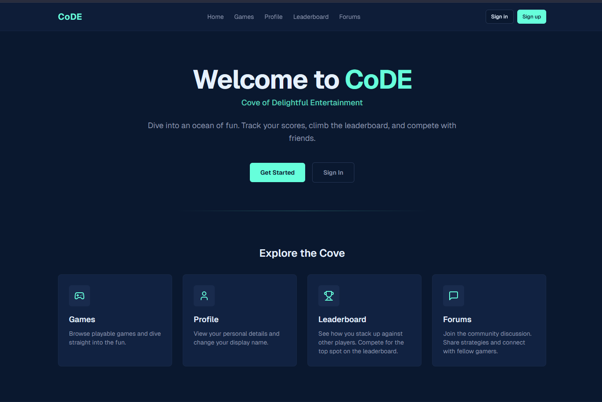
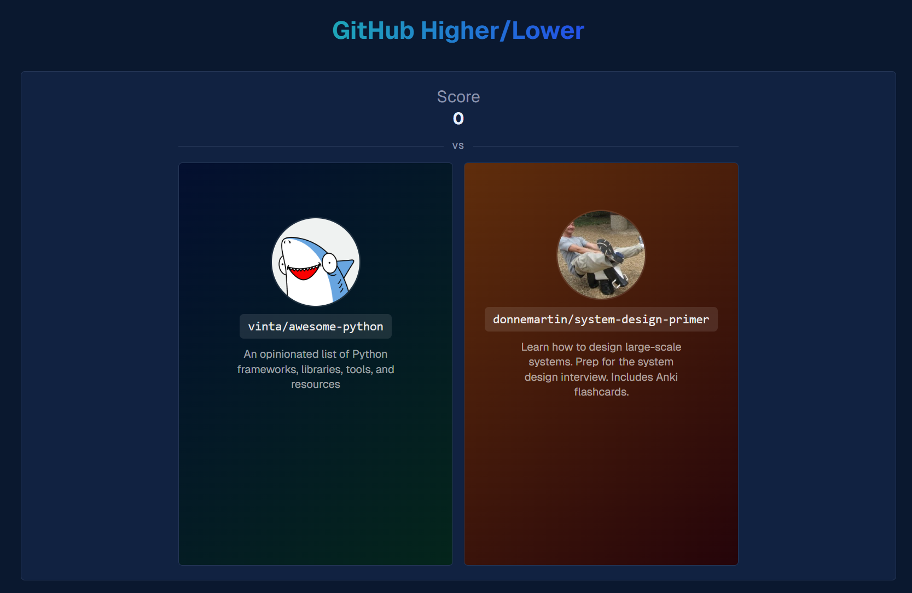
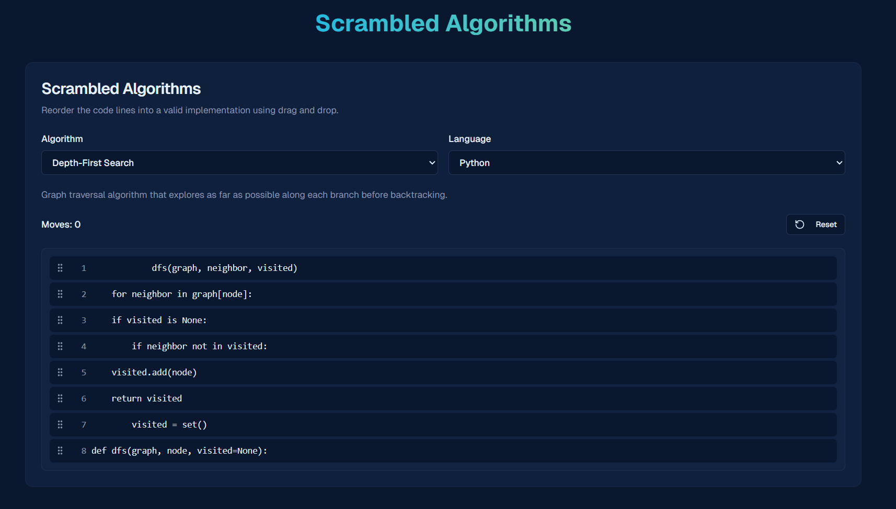
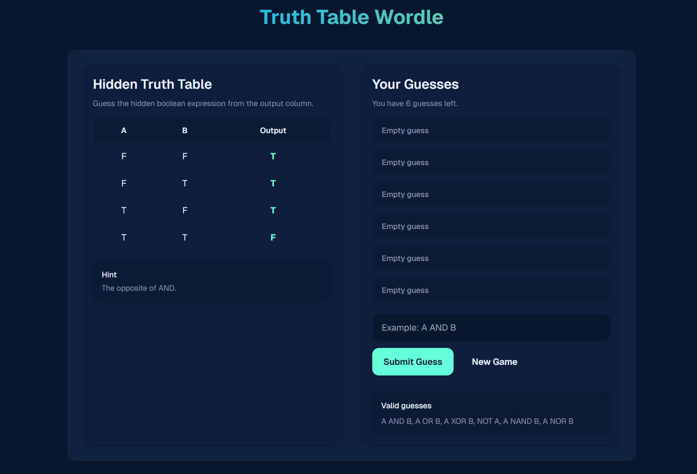
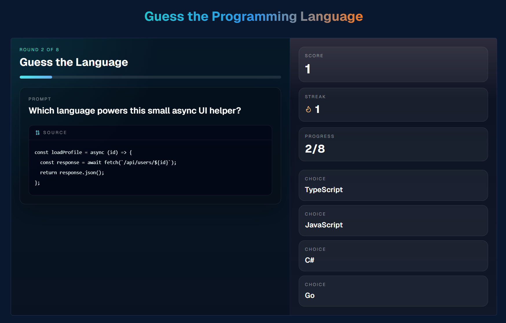

# CoDE

A web-based game platform for programmers that delivers short games focused on logic and programming concepts.


## Features
- Authentication system
- User profiles
- Forums
- Game-specific leaderboards
- Site-wide analytics dashboard
- Game library with four unique web games:
  - GitHub Higher/Lower
    
  - Scrambled Algorithms
    
  - Truth Table Wordle
    
  - Guess the Programming Language
    

## Technology Stack
- Next.js
- Supabase
- React
- Tailwind CSS
- TypeScript

## Setup

1. Clone the repository and install Next.js with `npm`:
```bash
git clone https://github.com/tyler-awender/CoDE.git
cd CoDE
npm install next
```

2. Rename `.env.example` to `.env.local` and populate with Supabase connection variables:
```bash
NEXT_PUBLIC_SUPABASE_URL=<SUBSTITUTE_SUPABASE_URL>
NEXT_PUBLIC_SUPABASE_PUBLISHABLE_KEY=<SUBSTITUTE_SUPABASE_PUBLISHABLE_KEY>
```

3. Run the Next.js development server:
```bash
npm run dev
```
